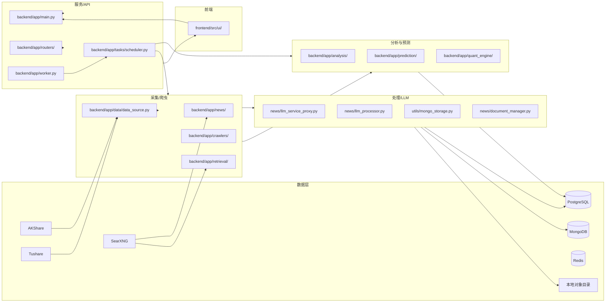
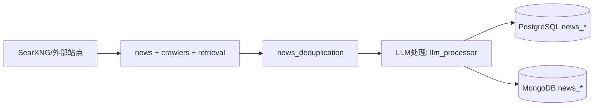
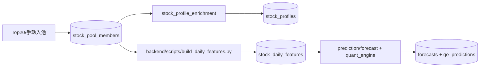
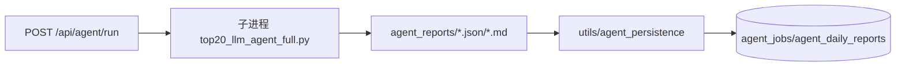
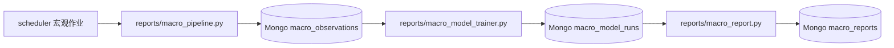

# AIStock 系统架构文档

更新时间：2026-04-21

## 1. 系统分层总览



## 2. 后端模块职责矩阵（backend/app 直接子目录）

| 模块 | 职责 |
|---|---|
| core | DB 连接、ORM 模型、常量、日志与基础配置 |
| analysis | 多维分析、评分、综合报告与技术信号 |
| news | 新闻采集、策略调度、LLM处理、去重、画像相关 |
| reports | 报告生成、宏观流水线、宏观训练、宏观日报 |
| crawlers | 多源爬虫、队列与限频、抓取编排 |
| scraper | 通用抓取工具与专用 fetcher |
| services | 业务服务层（以股票池与画像协同为主） |
| tasks | APScheduler 作业、任务管理、执行编排 |
| workers | 包级占位；真实 worker 入口为 backend/app/worker.py |
| agent | Web Agent 检索/阅读流程 |
| agents | PageCrawlAgent 等代理实现 |
| retrieval | RAG/Web 检索、抓取、缓存、阅读 |
| prediction | 预测模型、在线推理、持续学习 |
| quant_engine | 量化引擎（因子、训练、评估、信号、API） |
| backtest | 回测策略、性能分析与结果管理 |
| data | 行情数据统一入口（AKShare/Tushare） |
| utils | Mongo 存储、画像增强、持久化、横切工具 |
| routers | 业务路由聚合（含部分占位路由） |

## 3. 关键数据流图

### 3.1 新闻采集链路



### 3.2 股票池 -> 画像 -> 日特征 -> 预测链路



### 3.3 Agent 日报链路



### 3.4 宏观链路



## 4. 数据库清单

### 4.1 PostgreSQL（来自 backend/app/core/models.py 的 __tablename__）

核心业务表：
watchlist, stocks, prices_daily, ingest_state_daily, signals, forecasts, fundflow_daily, tasks, reports, agent_jobs, agent_daily_reports

新闻与检索：
news_sources, news_articles, news_keywords, search_logs, news_url_patterns, news_query_templates

事件与简报：
events, briefings, stock_events

特征与模型：
stock_daily_features, feature_correlations, model_registry, prediction_evaluations, model_lifecycle_events

股票池与画像：
stock_pool_members, stock_profiles

分析与报告：
daily_analysis, daily_reports, analysis_history

交易/组合/回测：
trading_signals, position_management, portfolios, paper_trading_snapshots, paper_trade_logs, simulated_trades, backtest_results, trade_decisions, execution_orders

量化辅助与其他：
northbound_flow, northbound_holding, dragon_tiger, analyst_ratings, financial_metrics, pipeline_runs

### 4.2 量化引擎 qe_* 表

qe_stock_models, qe_model_versions, qe_factor_definitions, qe_factor_values, qe_predictions, qe_evaluation_metrics, qe_signals, qe_training_jobs

### 4.3 MongoDB 集合（主要）

news_articles, stock_news_archive, news_sources, search_cache, duplicate_detection, news_analytics, stock_mentions, news_error_logs, macro_observations, macro_model_runs, macro_reports, agent_page_reports, agent_daily_reports

## 5. 关键 API 清单（按业务域）

- Agent：/api/agent/run, /api/agent/status/{job_id}, /api/agent/latest
- 股票池：/api/stock-pool, /api/stock-profile/{symbol}, /watchlist
- 特征与事件：/api/features/*, /api/events/*
- 预测：/api/report/{symbol}/full, /api/models/predict, /api/quant/*
- 宏观：/api/macro/overview, /api/macro/report
- 自选：/watchlist*, /api/watchlist/snapshot
- 新闻：/api/news/*, /api/storage/*
- 任务报告：/api/dashboard/reports, /api/dashboard/tasks, /api/tasks/*
- 管理：/admin/scheduler/*, /health, /api/llm/health
- RAG：/api/rag/*
- Pipeline 诊断：/api/stocks/{symbol}/pipeline-status, /api/stocks/{symbol}/pipeline-history, /api/stocks/{symbol}/pipeline/retry

## 6. 调度与部署

### 6.1 APScheduler 作业（tasks/scheduler.py）

- daily_pipeline：CRON_HOUR:CRON_MINUTE（默认 16:10）
- daily_pipeline_post_close：CRON_HOUR2:CRON_MINUTE2（默认 16:30）
- intelligent_news_collection：每 4 小时
- legacy_news_collection：每 12 小时
- news_center_collection：每 N 小时（N=NEWS_CENTER_CRON_EVERY_HOURS）
- macro_observation_pipeline：MACRO_CRON_*（默认 19:45）
- macro_training_job：MACRO_TRAIN_CRON_*（默认 20:15）
- macro_report_job：MACRO_REPORT_CRON_*（默认 20:45）
- agent_daily_job：AGENT_DAILY_CRON_*（默认 20:10）

### 6.2 运行开关与进程角色

- ENABLE_SCHEDULER=1：API 进程可直接挂载调度器
- ENABLE_SCHEDULER=0：建议 API 与 Worker 分离，由 backend/app/worker.py 跑调度
- API 进程：FastAPI 路由服务
- Worker 进程：定时作业执行、内存看门狗

### 6.3 Docker Compose 入口

- docker-compose.yml：全栈入口
- docker-compose.local.yml：本地开发
- docker-compose.rsshub.yml：RSSHub 场景

## 7. 外部依赖接入

- SearXNG：新闻搜索与抓取入口
- Azure OpenAI：主 LLM 服务
- 本地 Qwen：LLM 回退链路
- AKShare / Tushare：行情与资金流数据源
- MongoDB：新闻、宏观、Agent 报告等非结构化数据
- Redis：缓存与短时状态
- MinIO：目前未接入，document_manager.ObjectStorage 仍为本地目录实现

## 8. 前后端数据流与组件关系图

```mermaid
flowchart LR
    subgraph FE [Frontend]
      AppTsx[App.tsx 价格走势卡片]
      StatusStrip[PricePredictionStatus]
      Drawer[PipelineDiagnosticsDrawer]
    end

    subgraph BE [Backend main.py + routers]
      FullReport[/api/report/{sym}/full 按需补数+重算/]
      PipStatus[/api/stocks/{sym}/pipeline-status/]
      PipHist[/api/stocks/{sym}/pipeline-history/]
      PipRetry[POST /api/stocks/{sym}/pipeline/retry]
    end

    subgraph DL [Data Layer]
      PricesDaily[(prices_daily)]
      Forecast[(forecasts)]
      Report[(reports.forecast_data)]
      PipelineRuns[(pipeline_runs)]
    end

    subgraph JOBS [Jobs]
      Scheduler[tasks/scheduler.run_daily_pipeline]
      Calendar[core/trading_calendar]
    end

    AppTsx --> FullReport
    AppTsx --> StatusStrip
    StatusStrip --> PipStatus
    StatusStrip -->|点击| Drawer
    Drawer --> PipHist
    StatusStrip -->|重试| PipRetry
    PipRetry -.触发.-> Scheduler

    FullReport --> PricesDaily
    FullReport --> Forecast
    FullReport --> Report
    FullReport --> Calendar

    Scheduler --> PricesDaily
    Scheduler --> Forecast
    Scheduler --> PipelineRuns
    Scheduler --> Calendar

    PipStatus --> PipelineRuns
    PipHist --> PipelineRuns
```

## 9. 功能完成度矩阵

| 模块 | 核心能力 | 状态 | 证据文件 |
|---|---|---|---|
| 路由层 | events/rag/briefings 业务路由 | 部分 | backend/app/routers/events.py, backend/app/routers/rag.py, backend/app/routers/briefings.py |
| 预测全量报告 | /api/report/{symbol}/full（按需补数+预测） | 完成 | backend/app/main.py |
| 交易日历 | 统一交易日/节假日计算 | 完成 | backend/app/core/trading_calendar.py |
| 调度流水线 | run_daily_pipeline + 分步状态落库 | 完成 | backend/app/tasks/scheduler.py, backend/app/tasks/pipeline_recorder.py |
| 报告聚合 | Report.forecast_data 只取最新批次 | 完成 | backend/app/tasks/task_manager.py |
| pipeline 诊断API | status/history/retry | 完成 | backend/app/routers/pipeline_status.py |
| 前端诊断栏 | 状态徽标、立即重试、详情Drawer | 完成 | frontend/src/ui/PricePredictionStatus.tsx, frontend/src/ui/PipelineDiagnosticsDrawer.tsx |
| 预测点状态渲染 | future/today/expired 区分显示 | 完成 | frontend/src/ui/App.tsx |
| Agent 报告 | 每日生成、落盘、持久化 | 完成 | backend/app/main.py, backend/app/utils/agent_persistence.py |
| 每日分析 | 分析引擎 + 报告输出 | 完成 | backend/app/analysis/, backend/app/reports/ |
| 预测模块 | 价格预测与推理 | 完成 | backend/app/prediction/ |
| 量化引擎 | 因子/训练/评估/API | 完成 | backend/app/quant_engine/ |
| 新闻采集 | 多源采集+去重+LLM处理 | 完成 | backend/app/news/, backend/app/crawlers/ |
| 宏观流水线 | 观测、训练、日报 | 完成 | backend/app/reports/macro_* |
| workers 包 | 包目录功能 | 占位 | backend/app/workers/__init__.py |
| worker 真实入口 | 独立进程调度执行 | 完成 | backend/app/worker.py |
| 文档对象存储 | MinIO 接入 | 占位 | backend/app/news/document_manager.py |
| 脚本触发链路 | build_daily_features/update_stock_pool | 完成（已恢复） | backend/scripts/build_daily_features.py, backend/scripts/update_stock_pool.py, backend/app/main.py |

## 10. 计划中重点说明

- routers/events.py、routers/rag.py、routers/briefings.py 目前仍含 pass 占位，属于“部分完成”。
- workers/ 包几乎为空，真实 worker 入口是 backend/app/worker.py。
- document_manager.ObjectStorage 仍是本地目录实现，未接入 MinIO。
- Agent 报告、每日分析、预测、量化引擎、新闻采集、宏观流水线属于当前主要“完成”能力。
- 关于 main.py 中脚本引用：历史上存在“脚本缺失导致永远跳过”的问题；当前仓库已补齐 backend/scripts/build_daily_features.py 与 backend/scripts/update_stock_pool.py，相关分支已可执行。
